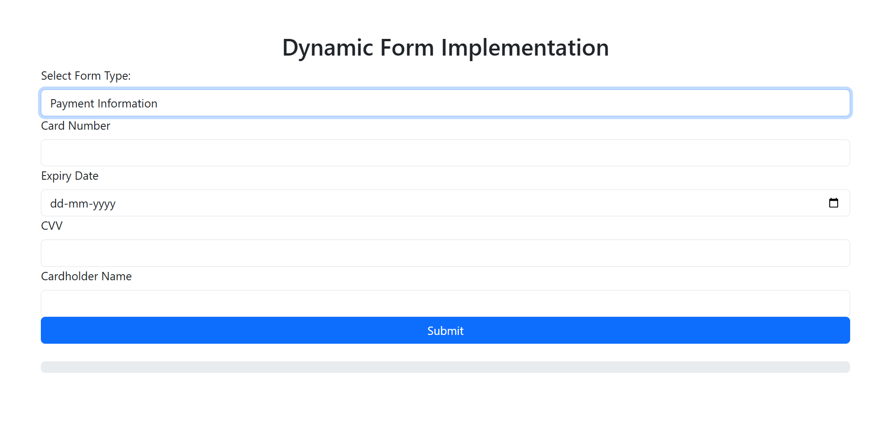

# **Dynamic Form with Progress Bar**

This project is a **Dynamic Form Implementation** with a real-time progress bar, built using **React** and **React-Bootstrap**. It dynamically adjusts form fields, validates inputs, and provides user feedback via a visually appealing progress bar and error alerts.

## **Features**

- **Dynamic Form Fields:** Automatically loads form fields based on the selected form type.
- **Real-Time Progress Bar:** Displays progress as users fill required fields.
- **Form Validation:** Ensures mandatory fields are filled before submission.
- **Error Alerts:** Highlights missing required fields with error messages.
- **Multiple Form Types:** Supports different form structures like user information, address details, and payment information.

## **Technologies Used**

- **Frontend:** React, React-Bootstrap
- **Styling:** Custom CSS, Bootstrap
- **Version Control:** Git and GitHub

## **Setup and Installation**

Follow the steps below to set up the project on your local machine:

1. Clone the repository:
    ```bash
    git clone https://github.com/your-username/dynamic-form-progress.git
    ```

2. Navigate into the project folder:
    ```bash
    cd dynamic-form-progress
    ```

3. Install the dependencies:
    ```bash
    npm install
    ```

4. Run the application:
    ```bash
    npm start
    ```

5. Open your browser and visit:
    ```bash
    http://localhost:3000
    ```

## Usage

- Select a form type from the dropdown.
- Fill out the form fields.
- The progress bar will update in real-time based on the fields you complete.
- Upon submitting the form, you will receive feedback about the required fields.


## Demo Video
- Click to view the demonstration of the application’s features.
[](https://drive.google.com/file/d/1-cCS9NmqbWG4g-RLFzy9AylUo8FyA7PA/view?usp=drive_link)

Demo vedio link: https://drive.google.com/file/d/1-cCS9NmqbWG4g-RLFzy9AylUo8FyA7PA/view?usp=drive_link


# Folder Structure
```
dynamic-form-progress/
│
├── public/                  # Static assets
│   └── index.html
│
├── src/                     # Source code
│   ├── components/          # Reusable components (if applicable)
│   ├── App.css              # Styling
│   ├── App.js               # Main app logic
│   └── index.js             # App entry point
│
├── .gitignore               # Files to be ignored by Git
├── package.json             # Project dependencies and scripts
└── README.md                # Project documentation
```
# Future Enhancements
* Add more form types for different use cases.
* Implement backend integration for saving submitted data.
* Enhance UI with animations and accessibility features.

